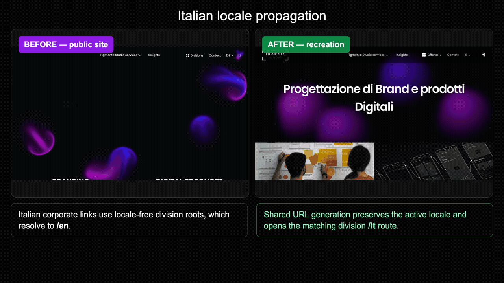
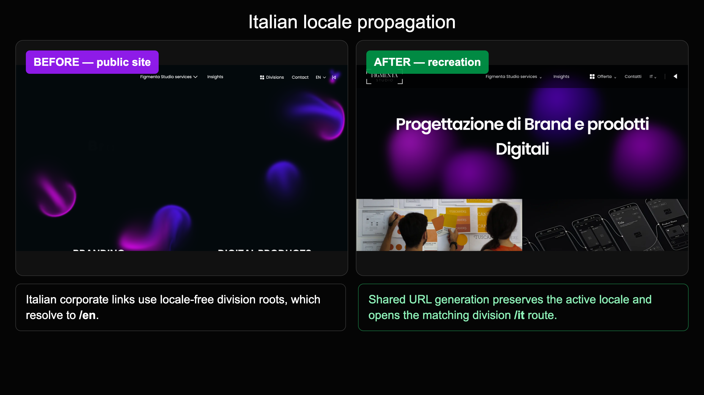
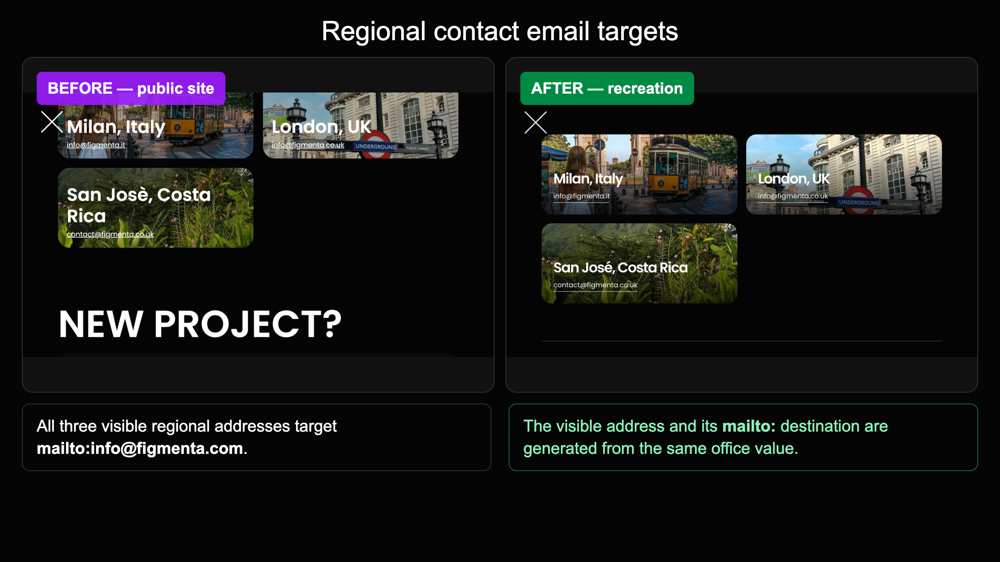
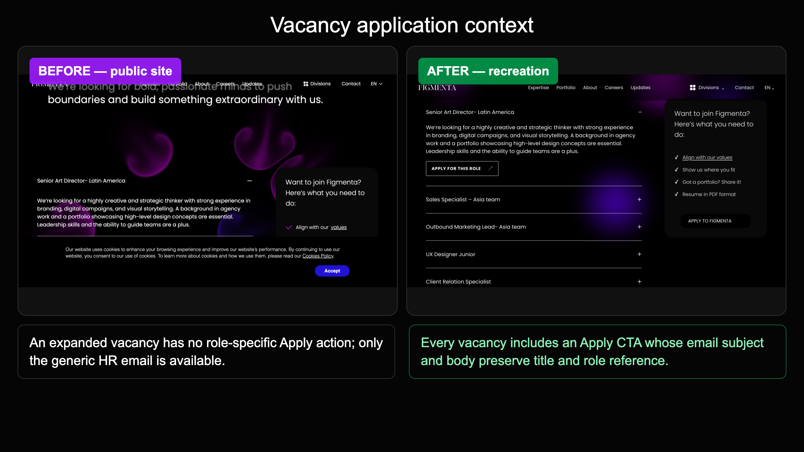

# Figmenta site recreation

This is a new, independent implementation of the Figmenta corporate site, four division landing pages, and Careers experience. It was built from public browser references because the original source repository, CMS, hosting configuration, and production integrations were not available.

This repository fixes three browser-confirmed production flows: incorrect regional email destinations, dropped Italian locale context, and lost vacancy context during Careers applications. It also recreates the shared public layout so those fixes can be reviewed in context.

For a complete categorized list of every implementation change, see [CHANGELOG.md](CHANGELOG.md).

## Run locally

```sh
npm install
npm run dev
```

Open `http://localhost:5173/en` or `http://localhost:5173/it`. The four division previews live at `/studio/en`, `/live/en`, `/productions/en`, and `/media/en`, with matching `/it` routes.

The recreated Careers page lives at `/en/careers` and `/it/careers`.

## Before and after

The recordings below were captured from the current public site and this local recreation:

- [Watch the public broken flows](docs/evidence/broken-flows.mp4)
- [Watch the corrected local flows](docs/evidence/fixed-flows.mp4)
- [Watch the side-by-side comparison](docs/evidence/figmenta-before-after.mp4)



### Italian locale propagation



### Regional email destinations



### Careers vacancy context



See the [full regression evidence](docs/evidence/README.md) for the browser-observed destinations and implementation notes.

## Confirmed broken flows and fixes

### 1. Regional contact emails opened the wrong mailbox

Affected public pages:

- `https://figmenta.com/en` and `/it`
- `https://studio.figmenta.com/en` and `/it`
- `https://live.figmenta.com/en` and `/it`
- `https://productions.figmenta.com/en` and `/it`
- `https://media.figmenta.com/en` and `/it`

Reproduction:

1. Open any affected page.
2. Select `Contact` or `Contatti`.
3. Inspect or activate a regional office email.

Browser-observed production behavior:

| Office | Visible address | Production `href` | Required `href` |
| --- | --- | --- | --- |
| Milan | `info@figmenta.it` | `mailto:info@figmenta.com` | `mailto:info@figmenta.it` |
| London | `info@figmenta.co.uk` | `mailto:info@figmenta.com` | `mailto:info@figmenta.co.uk` |
| San José | `contact@figmenta.co.uk` | `mailto:info@figmenta.com` | `mailto:contact@figmenta.co.uk` |

Impact: users saw a regional address but their mail client opened a different generic mailbox. That could misroute enquiries, confuse users, and make regional attribution unreliable.

Browser-visible root cause: all three anchors reused the same generic mailto value even though their displayed text was regional. The inaccessible production source prevents identifying the exact original component or commit.

Fix in this repository:

- `src/site.ts` defines each office once with its city, country, email, and public office image.
- `ContactSection` generates both the visible address and `mailto:` target from `office.email`.
- The shared overlay is used by Corporate, Studio, Live, Productions, and Media rather than patching five pages separately.
- The overlay now follows the public layout more closely: photographic office cards, two-column desktop grid, responsive single-column layout, phone and WhatsApp actions, and a project-enquiry form that composes an email because the production form API is unavailable.

### 2. Italian locale was dropped when opening a division

Reproduction:

1. Open `https://figmenta.com/it`.
2. Open the divisions navigation.
3. Select Studio, Live, Productions, or Media.

Browser-observed production behavior:

```text
figmenta.com/it → studio.figmenta.com/ → studio.figmenta.com/en
figmenta.com/it → live.figmenta.com/ → live.figmenta.com/en
figmenta.com/it → productions.figmenta.com/ → productions.figmenta.com/en
figmenta.com/it → media.figmenta.com/ → media.figmenta.com/en
```

Impact: Italian visitors unexpectedly changed language when moving between parts of the same group website.

Browser-visible root cause: the Italian corporate page rendered locale-free subdomain URLs. Each division then applied its English default redirect.

Fix in this repository:

- `siteHref(site, locale, hostname)` is the single URL-generation function.
- Corporate desktop navigation, mobile navigation, the division dropdown, division rows, locale switches, and back-to-group links all use it.
- Production-style hosts generate `https://{division}.figmenta.com/{locale}`.
- Local preview routes generate `/{division}/{locale}` so all sites can be tested on one origin.

Corrected matrix:

| Starting locale | Studio | Live | Productions | Media |
| --- | --- | --- | --- | --- |
| `/en` | `/studio/en` | `/live/en` | `/productions/en` | `/media/en` |
| `/it` | `/studio/it` | `/live/it` | `/productions/it` | `/media/it` |

### 3. Careers applications lost the selected vacancy

Reproduction:

1. Open `https://figmenta.com/en/careers`.
2. Expand a vacancy such as `Senior Art Director- Latin America`.
3. Review the available application actions.

Browser-observed production behavior:

- The vacancy description expanded correctly.
- The expanded vacancy had no role-specific Apply action.
- The only application link was the global `APPLY TO FIGMENTA` action.
- Its destination was exactly `mailto:hr@figmenta.com`, without a subject, job ID, role title, body, or application URL.

Impact: HR received generic applications with no automatic indication of the vacancy the candidate intended to apply for. Candidates had to remember and manually type the role.

Architecture investigation:

- Public vacancy data exposed titles and descriptions.
- No public vacancy ID, ATS link, `application.figmenta.com` relationship, or role-specific application URL was present.
- Email therefore appears to be the current public application mechanism. This recreation does not invent an unverified ATS integration.

Fix in this repository:

- Every vacancy in `src/careers.ts` has a stable local slug, title, and localized description.
- Each expanded vacancy includes `Apply for this role` or `Candidati per questo ruolo`.
- `vacancyApplicationHref` generates the destination from the selected vacancy data.
- The email subject contains the selected title.
- The email body contains the title and stable role reference.
- The general `Apply to Figmenta` action remains separate for open applications.
- Accordion state is tied to the selected slug, so opening one role cannot inherit another role's application context.

Example corrected destination:

```text
mailto:hr@figmenta.com
  ?subject=Application – Senior Art Director- Latin America
  &body=Role: Senior Art Director- Latin America
        Role reference: senior-art-director-latin-america
```

## Shared implementation

The recreation intentionally avoids fixing the same issue separately on each site:

- `src/site.ts` — locales, offices, division metadata, hostname routing, and shared URL generation.
- `src/App.tsx` — shared desktop/mobile navigation and contact overlay.
- `src/careers.ts` — vacancy data and application-link generation.
- `src/CareersPage.tsx` — data-driven vacancy accordion and Careers content.
- `src/showcase.ts` — division hero, feature, capability, and case content.
- `src/ShowcasePage.tsx` — shared corporate and division page rendering.
- `src/site.test.tsx` and `src/careers.test.tsx` — regression coverage.

## UI recreation coverage

Recreated UI and behavior:

- Corporate, Studio, Live, Productions, and Media landing pages in English and Italian.
- Public Figmenta and division logos.
- Fixed desktop headers, mobile navigation, division menu, locale control, and back-to-group action.
- Division hero copy, service imagery, overview sections, capabilities/tools, case grids, outros, and footer.
- Careers hero, vacancy accordion, general-application card, benefits, values overlay, and vacancy-specific CTA.
- Contact overlay with the same public Milan, London, and San José imagery and desktop card arrangement.
- Keyboard Escape handling and body scroll locking for overlays.
- Browser back/forward compatibility because locale and division remain URL state.

Known fidelity and integration limits:

- The production animated fluid/WebGL background is approximated with CSS glows; its exact renderer was not available.
- The recreation hotlinks publicly accessible Figmenta/Sanity assets and does not include the production CMS.
- Expertise, Portfolio, About, and Updates were outside the selected core-page scope and link to the public site.
- The production contact backend was unavailable. The recreated project form validates required fields and opens a populated email instead of claiming to submit to the production API.
- Cookie consent, analytics, production tracking, DNS, and deployment credentials are not included.
- This repository does not change the existing production websites until it is connected to hosting and the relevant domains.

## Automated regression coverage

The test suite verifies:

- Every office displays the same email used by its `mailto:` link.
- Public office imagery is associated with the correct office.
- All five sites expose the three correct regional links in English and Italian.
- Corporate `/en` and `/it` navigation points every division to the matching locale.
- Desktop and mobile menus use the same URL-generation logic.
- Locale-free routes default to English without affecting explicit Italian routes.
- Every division renders the expected localized hero and two service images.
- Contact opens and closes without losing the current division or locale.
- Every active vacancy exposes an Apply action.
- Different vacancies generate different role context.
- Subject and body contain the selected title and stable reference.
- General/open applications remain generic and independent.
- English and Italian Careers routes behave consistently.

## Manual browser QA

Verified in the browser:

- All ten core landing routes: Corporate plus four divisions in `/en` and `/it`.
- `/it` division menu links, Studio navigation, and back/forward history.
- All regional email targets in the contact overlay.
- Office image loading and responsive contact layout.
- At least two distinct Careers vacancies and their different application destinations.
- Repeated vacancy open/close behavior without stale context.
- Service images, locale switches, document language, and browser console.

## Deploying on the Figmenta domains

The same build can serve `figmenta.com` and the `studio`, `live`, `productions`, and `media` subdomains. It reads the hostname to select the site and uses `/{locale}` paths on each domain. On localhost or a preview hostname it uses `/{division}/{locale}` so all five pages can be reviewed on one origin. Connect the domains and configure DNS in the hosting account before using this as a replacement. A deployment of this repository alone does not change the current production sites.

## Validation

```sh
npm run lint
npm run typecheck
npm test
npm run build
```

The office email addresses are defined once in `src/site.ts`; `src/App.tsx` derives each `mailto:` target from the same `email` value shown to visitors. `siteHref` generates the division URLs from the active locale for both desktop and mobile navigation.
